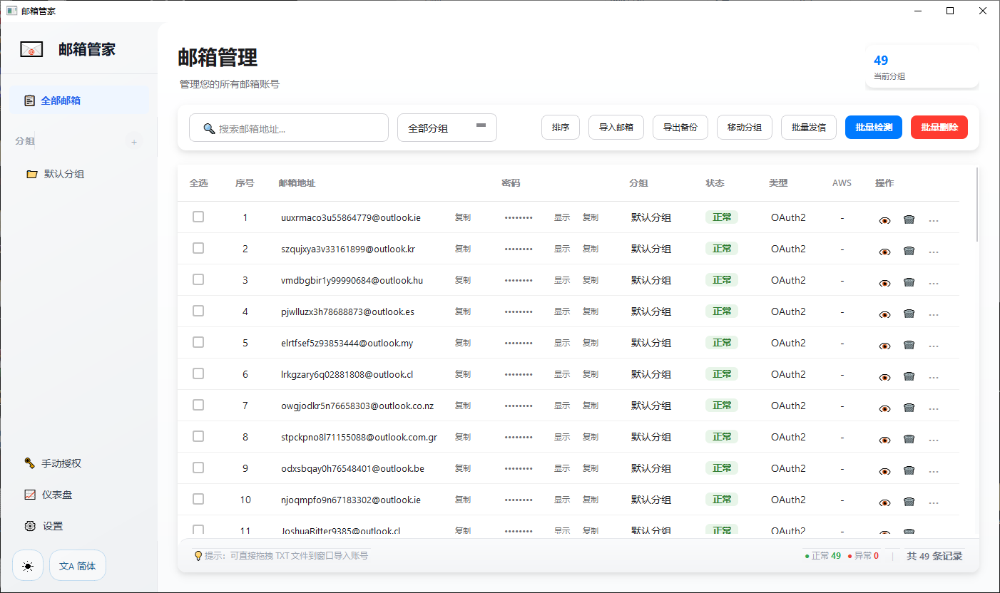

<div align="center">

# Email Manager (邮箱管家)

**Batch email account management tool with modern Fluent Design UI**

批量邮箱账号管理工具 | 支持 OAuth2 & IMAP | Microsoft Fluent Design 风格

[](LICENSE)
[](https://www.python.org/)
[](https://pypi.org/project/PyQt5/)

</div>

---

## ✨ Features / 功能特性

### Account Management / 账号管理
- Batch import/export email accounts (批量导入/导出邮箱账号)
- Clipboard quick import with `Ctrl+Shift+V` (剪贴板快速导入)
- Drag & drop TXT file import (拖拽 TXT 文件导入)
- Group management: create, rename, delete (分组管理)
- Auto deduplication on import (导入自动去重)
- Account notes/remarks (账号备注)

### Email / 邮件功能
- View emails: Inbox, Spam, Sent, etc. (收件箱、垃圾邮件、已发送)
- Compose, reply, forward (写邮件、回复、转发)
- Attachment support (附件支持)
- Email search (邮件搜索)
- Batch send emails (批量发送)

### Status Check / 状态检测
- Batch account status detection (批量检测账号状态)
- AWS verification email auto-tagging (AWS 验证码邮件自动标记)
- Account statistics dashboard (账号统计仪表盘)

### UI / 界面
- Dark / Light theme toggle (明暗主题切换)
- Chinese / English bilingual (中英文双语)
- Right-click context menu (右键上下文菜单)
- System tray minimize (系统托盘最小化)
- Modern Fluent Design style (现代 Fluent Design 风格)

## 🔐 Authentication / 认证方式

| Email Provider | Auth Method | Notes |
|----------------|-------------|-------|
| Outlook / Hotmail | OAuth2 | Auto-detect Graph API or Outlook REST API |
| QQ / 163 / Gmail | IMAP | Use app-specific password |

### OAuth2 Manual Authorization

For Outlook accounts without a token:
1. Click "OAuth2 Authorization" in the sidebar
2. Edge browser opens in InPrivate mode
3. Complete Microsoft login manually
4. App captures the auth code and obtains token automatically
5. Token is saved to the local database

## 🚀 Quick Start / 快速开始

### Prerequisites / 环境要求

- Python 3.10+
- Windows OS (recommended)

### Install & Run / 安装运行

```bash
# Clone the repo
git clone https://github.com/Mengv0320/Email-Manager.git
cd Email-Manager/邮箱管家

# Install dependencies
pip install -r requirements.txt

# Run
python main.py
```

### Build EXE / 打包

```bash
build.bat
```

Output: `dist/邮箱管家/`

## � Import Format / 导入格式

```
email----password----client_id----refresh_token
```

- Separator between accounts: newline or `$`
- `client_id` and `refresh_token` are optional (for OAuth2 accounts only)

Example:
```
user@outlook.com----mypassword
user2@outlook.com----pass2----9e5f94bc-xxxx----refresh_token_here
```

## 📁 Project Structure / 项目结构

```
邮箱管家/
├── main.py              # Entry point / 入口文件
├── core/
│   ├── email_client.py  # Email client (OAuth2 + IMAP)
│   ├── oauth2_helper.py # OAuth2 authorization helper
│   └── i18n.py          # Internationalization (i18n)
├── database/
│   └── db_manager.py    # SQLite database manager
├── ui/
│   ├── main_window.py   # Main window
│   ├── sidebar.py       # Sidebar navigation
│   ├── dialogs.py       # Dialog windows
│   ├── theme.py         # Theme manager (dark/light)
│   └── system_tray.py   # System tray
├── assets/              # Icon resources
└── data/
    └── emails.db        # Local database (auto-created)
```

## ⌨️ Keyboard Shortcuts / 快捷键

| Shortcut | Action |
|----------|--------|
| `Ctrl+Shift+V` | Import accounts from clipboard |
| Drag TXT file | Quick import accounts |

## 🛠️ Tech Stack / 技术栈

- **PyQt5** - GUI framework
- **SQLite** - Local database
- **Microsoft Graph API / Outlook REST API** - Outlook email access
- **IMAP / SMTP** - Standard email protocols
- **Selenium** - OAuth2 browser automation

## 📸 Screenshot / 截图



## 🤝 Contributing / 贡献

Contributions are welcome! Feel free to open issues or submit pull requests.

欢迎提交 Issue 和 Pull Request！

## ⚠️ Disclaimer / 免责声明

This project is for learning and communication purposes only. The original author is unknown. If this project infringes on your rights, please contact us for removal.

本项目仅供学习交流使用，原作者不详。如本项目侵犯了您的权益，请联系删除。

- **Email**: [Open an Issue](https://github.com/Mengv0320/Email-Manager/issues)

## � Contact / 交流

本人是个小菜鸡，欢迎大佬们指点！关于技术交流请加入 QQ 群：**1076321843**

## �📄 License / 许可证

This project is licensed under the [MIT License](LICENSE).
